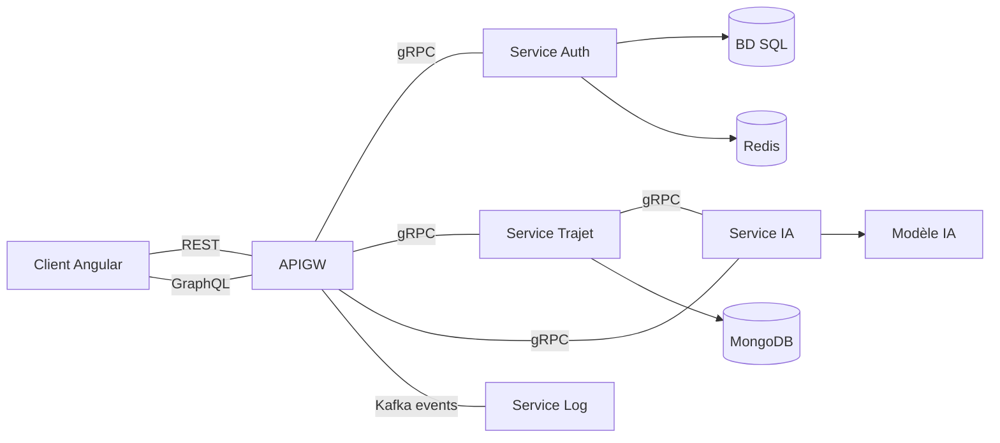

# Carpooling Microservices Application

A modern carpooling platform built using microservices architecture, enabling users to create, search, and book rides.


## Table of Contents

- [Architecture Overview](#architecture-overview)
- [Components](#components)
  - [Client Application](#client-application)
  - [API Gateway](#api-gateway)
  - [Authentication Service](#authentication-service)
  - [Trip Service](#trip-service)
  - [AI Service](#ai-service)
  - [Log Service](#log-service)
- [Data Schemas](#data-schemas)
- [API Documentation](#api-documentation)
  - [REST Endpoints](#rest-endpoints)
  - [GraphQL API](#graphql-api)
- [Authentication Flow](#authentication-flow)
- [User Journey](#user-journey)
- [Installation & Setup](#installation--setup)

## Architecture Overview

The application follows a microservices architecture pattern, with services communicating via gRPC and events being recorded through Kafka.



### gRPC Communication Flow

The microservices communicate with each other using gRPC (Google Remote Procedure Call), a high-performance RPC framework. Here's how the communication works:

#### API Gateway to Services
- **API Gateway → Auth Service**: The API Gateway communicates with the Auth Service through gRPC calls defined in `auth.proto`. It uses a gRPC client that connects to the Auth Service on port 50051, handling user registration, login, token verification, and logout operations.
- **API Gateway → Trip Service**: Communicates via gRPC using `trajet.proto`, connecting to the Trip Service on port 50052. Handles all trip-related operations like creating, reading, updating, and deleting trips as well as bookings.
- **API Gateway → AI Service**: Uses gRPC with `ia.proto` to communicate with the AI Service on port 50053, primarily for price prediction operations.

#### Service to Service Communication
- **Trip Service → AI Service**: The Trip Service directly communicates with the AI Service via gRPC to get price predictions for trips based on factors like available seats, departure, and destination.

#### Implementation Details
Each service implements:
1. **gRPC Server**: 
   - Listens on a specific port (Auth: 50051, Trip: 50052, AI: 50053)
   - Implements methods defined in the respective .proto files
   - Runs in parallel with the HTTP/REST server of each service

2. **gRPC Clients**:
   - API Gateway implements clients for all three services
   - Trip Service implements a client for the AI Service
   - Each client is configured with error handling and promise-based interfaces

This approach provides:
- Strong typing through Protocol Buffers
- Efficient binary serialization
- Stream support for real-time updates
- Language-agnostic communication (Node.js services can communicate with Python AI service)

## Components

### Client Application

The frontend is built with Angular, providing interfaces for:
- User authentication (login, registration)
- Trip search with filtering options
- Trip creation and management for drivers
- Booking trips as a passenger
- Managing reservations

Technologies:
- Angular 17 (standalone components)
- Apollo Client for GraphQL operations
- Reactive forms for user input
- JWT token-based authentication

### API Gateway

Central entry point for client communication, responsible for:
- Routing requests to appropriate microservices
- Authentication and authorization
- Exposing both REST and GraphQL APIs
- Kafka event production for logging

Technologies:
- Express.js
- Apollo Server for GraphQL
- gRPC clients for microservice communication
- Kafka producer for event logging

### Authentication Service

Handles all user authentication operations:
- User registration
- Login with JWT token issuance
- Token verification
- Secure logout (token invalidation)

Technologies:
- Express.js
- gRPC server
- SQLite database for user storage
- Redis for token management and verification
- JWT for authentication tokens
- Bcrypt for password hashing

### Trip Service

Core service for trip management functionality:
- Creating and managing trips (CRUD operations)
- Trip search with multiple filters
- Booking system with reservation management
- Integration with AI service for price prediction

Technologies:
- Express.js
- gRPC server
- MongoDB for data storage
- Mongoose for data modeling

### AI Service

Provides intelligent price estimation for trips:
- ML-based price prediction model
- Takes into account factors like distance, available seats, etc.

Technologies:
- Python (FastAPI)
- gRPC server
- Scikit-learn for machine learning model
- Joblib for model serialization

### Log Service

Centralized logging service for monitoring and analysis:
- Consumes Kafka events from various services
- Records system events and user actions
- Structured logging for better analysis

Technologies:
- Node.js
- Kafka consumer
- Winston for structured logging

## Data Schemas

### User Schema (Authentication Service)

```sql
CREATE TABLE users (
  id INTEGER PRIMARY KEY AUTOINCREMENT,
  username TEXT UNIQUE NOT NULL,
  email TEXT UNIQUE NOT NULL,
  password TEXT NOT NULL,
  role TEXT NOT NULL CHECK (role IN ('conducteur', 'passager')),
  created_at TIMESTAMP DEFAULT CURRENT_TIMESTAMP,
  updated_at TIMESTAMP DEFAULT CURRENT_TIMESTAMP
)
```

### Trip Schema (Trip Service)

```javascript
const TrajetSchema = new mongoose.Schema({
  depart: { type: String, required: true },
  destination: { type: String, required: true },
  conducteurId: { type: Number, required: true },
  conducteurNom: { type: String },
  dateDepart: { type: Date, required: true },
  placesDisponibles: { type: Number, required: true, min: 1 },
  placesReservees: { type: Number, default: 0 },
  prix: { type: Number, required: true },
  description: { type: String },
  dateCreation: { type: Date, default: Date.now },
  reservations: [ReservationSchema]
});
```

### Reservation Schema (Trip Service)

```javascript
const ReservationSchema = new mongoose.Schema({
  _id: { type: String, required: true },
  passagerId: { type: Number, required: true },
  passagerNom: { type: String, required: true },
  places: { type: Number, required: true, min: 1 },
  dateReservation: { type: Date, default: Date.now }
});
```

## API Documentation

### REST Endpoints

#### Authentication

| Endpoint | Method | Description | Parameters | Response |
|----------|--------|-------------|------------|----------|
| `/api/auth/register` | POST | Register a new user | `username`, `email`, `password`, `role` | `{ success, message, token, userId, username, role }` |
| `/api/auth/login` | POST | Authenticate a user | `email`, `password` | `{ success, message, token, userId, username, role }` |
| `/api/auth/verify` | GET | Verify JWT token | Bearer token in header | `{ success, message, user }` |
| `/api/auth/logout` | POST | Logout and revoke token | Bearer token in header | `{ success, message }` |

#### Trips

| Endpoint | Method | Description | Auth Required | Response |
|----------|--------|-------------|---------------|----------|
| `/api/trajets` | GET | Get all trips with optional filters | No | `{ success, message, trajets: [Trajet] }` |
| `/api/trajets/:id` | GET | Get a trip by ID | No | `{ success, message, trajet: Trajet }` |
| `/api/mes-trajets` | GET | Get trips created by authenticated user | Yes | `{ success, message, trajets: [Trajet] }` |
| `/api/mes-reservations` | GET | Get trips booked by authenticated user | Yes | `{ success, message, trajets: [Trajet] }` |
| `/api/trajets` | POST | Create a new trip | Yes (driver role) | `{ success, message, trajet: Trajet }` |
| `/api/trajets/:id` | PUT | Update a trip | Yes (owner only) | `{ success, message, trajet: Trajet }` |
| `/api/trajets/:id` | DELETE | Delete a trip | Yes (owner only) | `{ success, message }` |
| `/api/trajets/:id/reservations` | POST | Book a trip | Yes | `{ success, message, reservation, trajet }` |
| `/api/trajets/:trajetId/reservations/:reservationId` | DELETE | Cancel a booking | Yes (passenger only) | `{ success, message }` |

#### AI Service

| Endpoint | Method | Description | Parameters | Response |
|----------|--------|-------------|------------|----------|
| `/api/ia/predict-price` | POST | Predict trip price | `placesDisponibles`, `depart`, `destination` | `{ success, message, prixEstime }` |

### GraphQL API

#### Queries

```graphql
# Authentication
query VerifyToken($token: String!) {
  verifyToken(token: $token) {
    success
    message
    user {
      id
      username
      email
      role
    }
  }
}

# Trips
query GetAllTrajets($filters: TrajetFilters) {
  trajets(filters: $filters) {
    success
    message
    trajets {
      id
      depart
      destination
      conducteurId
      conducteurNom
      dateDepart
      placesDisponibles
      placesReservees
      prix
      description
      dateCreation
      reservations {
        id
        passagerId
        passagerNom
        places
        dateReservation
      }
    }
  }
}

query GetTrajetById($id: ID!) {
  trajet(id: $id) {
    success
    message
    trajet {
      # Same fields as above
    }
  }
}

query GetMesTrajets {
  mesTrajets {
    success
    message
    trajets {
      # Same fields as above
    }
  }
}

query GetMesReservations {
  mesReservations {
    success
    message
    trajets {
      # Same fields as above
    }
  }
}

# AI
query PredictPrice($input: PricePredictionInput!) {
  predictPrice(input: $input) {
    success
    message
    prixEstime
  }
}
```

#### Mutations

```graphql
# Authentication
mutation Register($input: RegisterInput!) {
  register(input: $input) {
    success
    message
    token
    userId
    username
    role
  }
}

mutation Login($input: LoginInput!) {
  login(input: $input) {
    success
    message
    token
    userId
    username
    role
  }
}

mutation Logout($token: String!) {
  logout(token: $token) {
    success
    message
  }
}

# Trips
mutation CreateTrajet($input: TrajetInput!) {
  createTrajet(input: $input) {
    success
    message
    trajet {
      id
      depart
      destination
      dateDepart
      placesDisponibles
      prix
      description
    }
  }
}

mutation UpdateTrajet($id: ID!, $input: UpdateTrajetInput!) {
  updateTrajet(id: $id, input: $input) {
    success
    message
    trajet {
      # Trip fields
    }
  }
}

mutation DeleteTrajet($id: ID!) {
  deleteTrajet(id: $id) {
    success
    message
  }
}

mutation BookTrajet($input: BookingInput!) {
  bookTrajet(input: $input) {
    success
    message
    reservation {
      id
      passagerId
      passagerNom
      places
      dateReservation
    }
    trajet {
      id
      placesDisponibles
      placesReservees
    }
  }
}

mutation CancelBooking($input: CancelBookingInput!) {
  cancelBooking(input: $input) {
    success
    message
  }
}
```

## Authentication Flow

The application implements JWT token authentication with Redis-based token verification:

1. **Registration/Login**: User credentials are validated and a JWT token is issued
2. **Token Storage**:
   - Client stores token in localStorage
   - Server stores token in Redis with expiration time
3. **Request Authentication**:
   - Client includes token in Authorization header
   - API Gateway validates token through Auth Service
   - Auth Service checks token validity in Redis
4. **Logout**:
   - Token is removed from Redis
   - Client removes token from localStorage

This approach provides secure authentication with the ability to revoke tokens server-side.

Example of token verification flow:

```javascript
// API Gateway verification
const authenticate = async (req, res, next) => {
  const token = req.headers.authorization?.split(' ')[1];
  
  if (!token) {
    return res.status(401).json({ 
      success: false, 
      message: 'Authentication required' 
    });
  }

  try {
    const result = await verifyToken({ token });
    
    if (!result.success) {
      return res.status(401).json({ 
        success: false, 
        message: 'Invalid token' 
      });
    }
    
    // Store user information in the request
    req.user = result.user;
    next();
  } catch (error) {
    return res.status(500).json({ 
      success: false, 
      message: 'Authentication error' 
    });
  }
};
```

## User Journey

### Authentication Flow

Users can register as either a driver or passenger:


### Driver Experience

Drivers can create and manage trips:


### Passenger Experience

Passengers can search for trips and book them:


### Logging and Event Tracking

The system records all important events using Kafka:


## Installation & Setup

### Prerequisites

- Node.js 16+
- Python 3.8+
- MongoDB
- Redis
- Kafka

### Setup Instructions

1. Clone the repository
2. Install dependencies for each service:
   ```bash
   # Client
   cd client
   npm install

   # API Gateway
   cd ../services/api-gateway
   npm install

   # Auth Service
   cd ../service-auth
   npm install

   # Trip Service
   cd ../service-trajet
   npm install

   # AI Service
   cd ../service-ia
   pip install -r requirements.txt

   # Log Service
   cd ../service-log
   npm install
   ```

3. Configure environment variables for each service
4. Start the services:
   ```bash
   # Start services in separate terminals
   # Auth Service
   cd services/service-auth
   npm start

   # Trip Service
   cd services/service-trajet
   npm start

   # AI Service
   cd services/service-ia
   python main.py

   # Log Service
   cd services/service-log
   npm start

   # API Gateway
   cd services/api-gateway
   npm start

   # Client
   cd client
   npm start
   ```

5. Access the application at http://localhost:4200