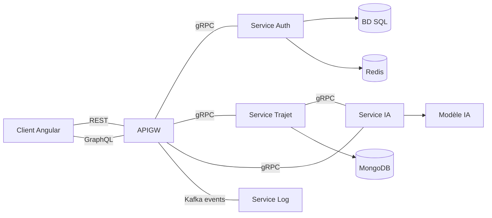

# Carpooling Microservices Application

A modern carpooling platform built using microservices architecture, enabling users to create, search, and book rides.


## Table of Contents

- [Architecture Overview](#architecture-overview)
- [Microservices](#microservices)
  - [API Gateway](#api-gateway)
  - [Authentication Service](#authentication-service)
  - [Trip Service](#trip-service)
  - [AI Service](#ai-service)
  - [Log Service](#log-service)
- [Client Application](#client-application)
- [Inter-Service Communication](#inter-service-communication)
  - [gRPC Communication](#grpc-communication)
  - [Event-Driven Architecture](#event-driven-architecture)
- [Data Schemas](#data-schemas)
- [API Documentation](#api-documentation)
  - [REST Endpoints](#rest-endpoints)
  - [GraphQL API](#graphql-api)
- [Authentication Flow](#authentication-flow)
- [User Journey](#user-journey)
- [Technical Implementation Details](#technical-implementation-details)
  - [Token Management](#token-management)
  - [Database Design](#database-design)
  - [Error Handling](#error-handling)
- [Deployment](#deployment)
- [Installation & Setup](#installation--setup)

## Architecture Overview

The application implements a microservices architecture pattern with the following key characteristics:

- **Service Independence**: Each service can be developed, deployed, and scaled independently
- **Polyglot Implementation**: Services use technologies best suited for their specific functions
- **Protocol-Based Communication**: Services communicate via well-defined protocols (gRPC)
- **Event-Driven Logging**: System events captured through Kafka for asynchronous processing
- **Gateway Pattern**: Single entry point with API Gateway managing all client interactions
- **Data Isolation**: Each service owns its data store and exposes it only via API



## Microservices

### API Gateway

The API Gateway serves as the single entry point for all client requests, implementing the Backend for Frontend (BFF) pattern.

**Key Responsibilities:**
- Request routing to appropriate microservices based on context and path
- Protocol translation between client-facing REST/GraphQL and internal gRPC
- Authentication and authorization verification for protected resources
- Request/response transformation and aggregation
- Event production for system logging via Kafka

**Technical Implementation:**
- **Framework**: Node.js with Express.js for REST endpoints
- **GraphQL Server**: Apollo Server implementation for GraphQL API
- **gRPC Clients**: Client implementations for each microservice
- **Authentication**: JWT verification middleware for all protected routes
- **Event Production**: Kafka producer implementation for system events

**Code Structure:**
```
api-gateway/
  ├── graphql/
  │   ├── resolvers/      # GraphQL resolvers for each domain
  │   ├── schemas/        # GraphQL schema definitions
  │   └── types/          # GraphQL type definitions
  ├── routes/             # REST endpoint definitions
  └── src/
      ├── clients/        # gRPC client implementations
      └── utils/          # Utility functions, including Kafka producer
```

**Interaction Flow:**
1. Client request arrives at API Gateway
2. Request is authenticated if required (via middleware)
3. Request is routed to appropriate service via gRPC
4. Response is transformed and returned to client
5. Event is produced to Kafka for logging (for significant operations)

### Authentication Service

The Authentication Service manages user identity, credential verification, and access control.

**Key Responsibilities:**
- User registration and account management
- Secure password handling and validation
- JWT token issuance and validation
- Token revocation and session management

**Technical Implementation:**
- **Framework**: Node.js with Express.js
- **Database**: SQLite for user data persistence
- **Token Storage**: Redis for active token management
- **Communication**: gRPC server implementation
- **Security**: bcrypt for password hashing, JWT for token generation

**Security Features:**
- Password salting and hashing using bcrypt with 10 rounds
- Short-lived JWT tokens (1 hour expiration)
- Server-side token invalidation via Redis
- Rate limiting for login attempts
- Validation of all input data with Joi schema validation

**Database Schema:**
```sql
CREATE TABLE users (
  id INTEGER PRIMARY KEY AUTOINCREMENT,
  username TEXT UNIQUE NOT NULL,
  email TEXT UNIQUE NOT NULL,
  password TEXT NOT NULL,
  role TEXT NOT NULL CHECK (role IN ('conducteur', 'passager')),
  created_at TIMESTAMP DEFAULT CURRENT_TIMESTAMP,
  updated_at TIMESTAMP DEFAULT CURRENT_TIMESTAMP
)

CREATE TABLE revoked_tokens (
  id INTEGER PRIMARY KEY AUTOINCREMENT,
  token TEXT NOT NULL,
  expiry TIMESTAMP NOT NULL,
  revoked_at TIMESTAMP DEFAULT CURRENT_TIMESTAMP
)
```

**Token Management Flow:**
1. User logs in with valid credentials
2. Service generates JWT token with user information and expiration
3. Token is stored in Redis with TTL matching JWT expiration
4. Token is returned to client and stored in localStorage
5. For verification, token is checked against Redis to ensure it's still valid
6. On logout, token is removed from Redis to invalidate it immediately

### Trip Service

The Trip Service manages all trip-related operations, serving as the core business logic component.

**Key Responsibilities:**
- CRUD operations for trips
- Advanced search with filtering capabilities
- Booking system with reservation management
- Integration with AI service for price estimation

**Technical Implementation:**
- **Framework**: Node.js with Express.js
- **Database**: MongoDB for flexible trip data storage
- **Schema Validation**: Mongoose for data modeling and validation
- **Communication**: gRPC server for internal services communication
- **Integration**: gRPC client for AI service communication

**Data Models:**

```javascript
const TrajetSchema = new mongoose.Schema({
  depart: { type: String, required: true },
  destination: { type: String, required: true },
  conducteurId: { type: Number, required: true },
  conducteurNom: { type: String },
  dateDepart: { type: Date, required: true },
  placesDisponibles: { type: Number, required: true, min: 1 },
  placesReservees: { type: Number, default: 0 },
  prix: { type: Number, required: true },
  description: { type: String },
  dateCreation: { type: Date, default: Date.now },
  reservations: [ReservationSchema]
});

const ReservationSchema = new mongoose.Schema({
  _id: { type: String, required: true },
  passagerId: { type: Number, required: true },
  passagerNom: { type: String, required: true },
  places: { type: Number, required: true, min: 1 },
  dateReservation: { type: Date, default: Date.now }
});
```

**Business Logic Implementations:**
- Atomic reservation process ensuring data consistency
- Race condition handling for concurrent bookings
- Validation of available seats before reservation
- Trip search with filtering by date, location, available seats
- Automatic trip status updates based on reservation count

**Performance Optimizations:**
- Indexes on frequently queried fields (depart, destination, dateDepart)
- Pagination for large result sets
- Projection to limit returned fields when appropriate

### AI Service

The AI Service provides intelligent price estimation for trips using machine learning models.

**Key Responsibilities:**
- Price prediction based on trip attributes
- Model training and evaluation
- Serving predictions via gRPC API

**Technical Implementation:**
- **Framework**: Python with FastAPI
- **Machine Learning**: scikit-learn for model training and inference
- **Model Serialization**: joblib for model persistence
- **Communication**: gRPC server implementation
- **Development**: Jupyter notebooks for model experimentation

**Machine Learning Pipeline:**
1. Data preprocessing (feature extraction, normalization)
2. Model training using gradient boosting regression
3. Model evaluation using cross-validation
4. Serialization of trained model
5. Serving predictions via gRPC

**Features Used for Prediction:**
- Distance between departure and destination points
- Time of day for departure
- Day of week for departure
- Number of available seats
- Historical price data from similar routes

**Model Performance:**
- Mean Absolute Error: ~2.5€
- R² Score: 0.85
- Retraining schedule: Weekly based on new data

### Log Service

The Log Service provides centralized logging infrastructure for monitoring and analysis.

**Key Responsibilities:**
- Consuming events from Kafka
- Structured logging of system events
- Error aggregation and alerting

**Technical Implementation:**
- **Framework**: Node.js
- **Message Broker**: Kafka for consuming events
- **Logging**: Winston for structured logging
- **Storage**: File-based logging with rotation

**Event Types Logged:**
- Authentication events (login, logout, registration)
- Trip operations (creation, update, deletion)
- Booking operations (reservation, cancellation)
- API errors and exceptions

**Log Levels:**
- `error`: System errors requiring attention
- `warn`: Potential issues that aren't critical
- `info`: Normal operation events
- `debug`: Detailed information for debugging

**Log Structure:**
```javascript
{
  timestamp: "2023-05-10T14:30:00Z",
  level: "info",
  service: "trip-service",
  event: "trip.created",
  userId: "123",
  data: {
    tripId: "abc123",
    departure: "Paris",
    destination: "Lyon"
  },
  metadata: {
    requestId: "req-uuid",
    ipAddress: "192.168.1.1"
  }
}
```

## Client Application

The frontend application is implemented with Angular 17 featuring a modern SPA architecture.

**Key Features:**
- Standalone components architecture
- Reactive state management
- JWT authentication with interceptors
- GraphQL integration via Apollo Client
- Responsive design

**Technical Implementation:**
- **Framework**: Angular 17
- **State Management**: RxJS BehaviorSubject for auth state
- **API Integration**: Apollo Client for GraphQL, HttpClient for REST
- **Form Handling**: Reactive Forms with validation
- **Authentication**: JWT tokens with interceptor for request headers

**Component Architecture:**
```
client/
  └── src/
      └── app/
          ├── app.component.*     # Root component
          ├── app.config.ts       # App configuration
          ├── app.routes.ts       # Route definitions
          ├── graphql.module.ts   # GraphQL configuration
          ├── auth/               # Authentication components
          ├── dashboard/          # Dashboard components
          ├── navigation/         # Navigation components
          ├── services/           # Service layer
          ├── shared/             # Shared components
          └── trajets/            # Trip management components
```

**Authentication Flow:**
1. User enters credentials in login/register form
2. Auth service sends GraphQL mutation to API
3. On success, token is stored in localStorage
4. Auth interceptor adds token to all subsequent requests
5. Auth service maintains user state in BehaviorSubject
6. Guards protect routes based on authentication state

## Inter-Service Communication

### gRPC Communication

The system uses gRPC for efficient, typed inter-service communication.

**Benefits:**
- Strong typing with Protocol Buffers
- Efficient binary serialization
- Built-in code generation
- Support for streaming operations
- Language-agnostic interface definition

**Implementation:**
- Protocol definition in `.proto` files
- Code generation for server and client stubs
- Bidirectional streaming for real-time updates
- Error handling with standard gRPC error codes

**Example Protocol Definition (Auth Service):**
```protobuf
syntax = "proto3";

package auth;

service AuthService {
  rpc Register(RegisterRequest) returns (AuthResponse) {}
  rpc Login(LoginRequest) returns (AuthResponse) {}
  rpc VerifyToken(TokenRequest) returns (VerificationResponse) {}
  rpc Logout(TokenRequest) returns (LogoutResponse) {}
}

message RegisterRequest {
  string username = 1;
  string email = 2;
  string password = 3;
  string role = 4;
}

message LoginRequest {
  string email = 1;
  string password = 2;
}

message TokenRequest {
  string token = 1;
}

message AuthResponse {
  bool success = 1;
  string message = 2;
  string token = 3;
  int32 userId = 4;
  string username = 5;
  string role = 6;
}

message VerificationResponse {
  bool success = 1;
  string message = 2;
  User user = 3;
}

message User {
  int32 id = 1;
  string username = 2;
  string email = 3;
  string role = 4;
}

message LogoutResponse {
  bool success = 1;
  string message = 2;
}
```

### Event-Driven Architecture

Event-driven patterns are implemented for logging and cross-service notifications.

**Implementation:**
- Kafka as the event streaming platform
- Producers in API Gateway for event publication
- Consumers in Log Service for event processing
- Event schemas for consistent message structure

**Event Flow:**
1. API Gateway records significant events during request processing
2. Events are published to appropriate Kafka topics
3. Log Service consumes events and processes them
4. Events are stored in structured log files

**Event Types:**
- `user.registered`: New user registration
- `user.login`: User login events
- `user.logout`: User logout events
- `trip.created`: New trip creation
- `trip.updated`: Trip detail updates
- `trip.deleted`: Trip deletion
- `reservation.created`: New reservation
- `reservation.cancelled`: Reservation cancellation

## Data Schemas

### User Schema (Authentication Service)

```sql
CREATE TABLE users (
  id INTEGER PRIMARY KEY AUTOINCREMENT,
  username TEXT UNIQUE NOT NULL,
  email TEXT UNIQUE NOT NULL,
  password TEXT NOT NULL,
  role TEXT NOT NULL CHECK (role IN ('conducteur', 'passager')),
  created_at TIMESTAMP DEFAULT CURRENT_TIMESTAMP,
  updated_at TIMESTAMP DEFAULT CURRENT_TIMESTAMP
)
```

**Index Strategy:**
- Primary key on `id`
- Unique indexes on `email` and `username`
- Compound index on `role` and `created_at` for role-based queries

### Trip Schema (Trip Service)

```javascript
const TrajetSchema = new mongoose.Schema({
  depart: { type: String, required: true },
  destination: { type: String, required: true },
  conducteurId: { type: Number, required: true },
  conducteurNom: { type: String },
  dateDepart: { type: Date, required: true },
  placesDisponibles: { type: Number, required: true, min: 1 },
  placesReservees: { type: Number, default: 0 },
  prix: { type: Number, required: true },
  description: { type: String },
  dateCreation: { type: Date, default: Date.now },
  reservations: [ReservationSchema]
});
```

**MongoDB Indexes:**
```javascript
TrajetSchema.index({ depart: 1, destination: 1 });
TrajetSchema.index({ dateDepart: 1 });
TrajetSchema.index({ conducteurId: 1 });
TrajetSchema.index({ "reservations.passagerId": 1 });
```

**Validation Rules:**
- Departure date must be in the future
- Available seats must be greater than reserved seats
- Price must be positive and determined by AI service or manual input

### Reservation Schema (Trip Service)

```javascript
const ReservationSchema = new mongoose.Schema({
  _id: { type: String, required: true },
  passagerId: { type: Number, required: true },
  passagerNom: { type: String, required: true },
  places: { type: Number, required: true, min: 1 },
  dateReservation: { type: Date, default: Date.now }
});
```

**Business Rules:**
- Requested places must be available in the trip
- A passenger cannot book the same trip twice
- Reservation can be cancelled up to 24 hours before departure

## API Documentation

### REST Endpoints

#### Authentication

| Endpoint | Method | Description | Parameters | Response |
|----------|--------|-------------|------------|----------|
| `/api/auth/register` | POST | Register a new user | `username`, `email`, `password`, `role` | `{ success, message, token, userId, username, role }` |
| `/api/auth/login` | POST | Authenticate a user | `email`, `password` | `{ success, message, token, userId, username, role }` |
| `/api/auth/verify` | GET | Verify JWT token | Bearer token in header | `{ success, message, user }` |
| `/api/auth/logout` | POST | Logout and revoke token | Bearer token in header | `{ success, message }` |

#### Trips

| Endpoint | Method | Description | Auth Required | Response |
|----------|--------|-------------|---------------|----------|
| `/api/trajets` | GET | Get all trips with optional filters | No | `{ success, message, trajets: [Trajet] }` |
| `/api/trajets/:id` | GET | Get a trip by ID | No | `{ success, message, trajet: Trajet }` |
| `/api/mes-trajets` | GET | Get trips created by authenticated user | Yes | `{ success, message, trajets: [Trajet] }` |
| `/api/mes-reservations` | GET | Get trips booked by authenticated user | Yes | `{ success, message, trajets: [Trajet] }` |
| `/api/trajets` | POST | Create a new trip | Yes (driver role) | `{ success, message, trajet: Trajet }` |
| `/api/trajets/:id` | PUT | Update a trip | Yes (owner only) | `{ success, message, trajet: Trajet }` |
| `/api/trajets/:id` | DELETE | Delete a trip | Yes (owner only) | `{ success, message }` |
| `/api/trajets/:id/reservations` | POST | Book a trip | Yes | `{ success, message, reservation, trajet }` |
| `/api/trajets/:trajetId/reservations/:reservationId` | DELETE | Cancel a booking | Yes (passenger only) | `{ success, message }` |

#### AI Service

| Endpoint | Method | Description | Parameters | Response |
|----------|--------|-------------|------------|----------|
| `/api/ia/predict-price` | POST | Predict trip price | `placesDisponibles`, `depart`, `destination` | `{ success, message, prixEstime }` |

### GraphQL API

#### Queries

```graphql
# Authentication
query VerifyToken($token: String!) {
  verifyToken(token: $token) {
    success
    message
    user {
      id
      username
      email
      role
    }
  }
}

# Trips
query GetAllTrajets($filters: TrajetFilters) {
  trajets(filters: $filters) {
    success
    message
    trajets {
      id
      depart
      destination
      conducteurId
      conducteurNom
      dateDepart
      placesDisponibles
      placesReservees
      prix
      description
      dateCreation
      reservations {
        id
        passagerId
        passagerNom
        places
        dateReservation
      }
    }
  }
}

query GetTrajetById($id: ID!) {
  trajet(id: $id) {
    success
    message
    trajet {
      # Same fields as above
    }
  }
}

query GetMesTrajets {
  mesTrajets {
    success
    message
    trajets {
      # Same fields as above
    }
  }
}

query GetMesReservations {
  mesReservations {
    success
    message
    trajets {
      # Same fields as above
    }
  }
}

# AI
query PredictPrice($input: PricePredictionInput!) {
  predictPrice(input: $input) {
    success
    message
    prixEstime
  }
}
```

#### Mutations

```graphql
# Authentication
mutation Register($input: RegisterInput!) {
  register(input: $input) {
    success
    message
    token
    userId
    username
    role
  }
}

mutation Login($input: LoginInput!) {
  login(input: $input) {
    success
    message
    token
    userId
    username
    role
  }
}

mutation Logout($token: String!) {
  logout(token: $token) {
    success
    message
  }
}

# Trips
mutation CreateTrajet($input: TrajetInput!) {
  createTrajet(input: $input) {
    success
    message
    trajet {
      id
      depart
      destination
      dateDepart
      placesDisponibles
      prix
      description
    }
  }
}

mutation UpdateTrajet($id: ID!, $input: UpdateTrajetInput!) {
  updateTrajet(id: $id, input: $input) {
    success
    message
    trajet {
      # Trip fields
    }
  }
}

mutation DeleteTrajet($id: ID!) {
  deleteTrajet(id: $id) {
    success
    message
  }
}

mutation BookTrajet($input: BookingInput!) {
  bookTrajet(input: $input) {
    success
    message
    reservation {
      id
      passagerId
      passagerNom
      places
      dateReservation
    }
    trajet {
      id
      placesDisponibles
      placesReservees
    }
  }
}

mutation CancelBooking($input: CancelBookingInput!) {
  cancelBooking(input: $input) {
    success
    message
  }
}
```

## Authentication Flow

The application implements a secure JWT token authentication system with Redis-based token verification:

### Token Issuance

1. **User Authentication**:
   - User submits credentials (email/password)
   - Auth Service validates credentials against database
   - Passwords compared using bcrypt.compare()

2. **Token Generation**:
   ```javascript
   generateToken(user) {
     return jwt.sign(
       { 
         userId: user.id, 
         username: user.username,
         role: user.role 
       },
       config.jwtSecret,
       { expiresIn: config.jwtExpiration }
     );
   }
   ```

3. **Token Storage**:
   - Client stores token in localStorage
   - Server stores token in Redis with TTL matching JWT expiration
   ```javascript
   async function saveToken(userId, token, expiry) {
     const key = `token:${userId}:${token}`;
     await redisClient.set(key, 'active');
     await redisClient.expireAt(key, expiry);
   }
   ```

### Token Verification

1. **Client-Side**:
   - Token attached to all requests via HTTP interceptor
   ```typescript
   export const authInterceptor: HttpInterceptorFn = (
     req: HttpRequest<unknown>,
     next: HttpHandlerFn
   ) => {
     const token = localStorage.getItem('auth_token');
     if (token) {
       const clonedReq = req.clone({
         headers: req.headers.set('Authorization', `Bearer ${token}`)
       });
       return next(clonedReq);
     }
     return next(req);
   };
   ```

2. **API Gateway Verification**:
   ```javascript
   const authenticate = async (req, res, next) => {
     const token = req.headers.authorization?.split(' ')[1];
     
     if (!token) {
       return res.status(401).json({ 
         success: false, 
         message: 'Authentication required' 
       });
     }

     try {
       const result = await verifyToken({ token });
       
       if (!result.success) {
         return res.status(401).json({ 
           success: false, 
           message: 'Invalid token' 
         });
       }
       
       // Store user information in the request
       req.user = result.user;
       next();
     } catch (error) {
       return res.status(500).json({ 
         success: false, 
         message: 'Authentication error' 
       });
     }
   };
   ```

3. **Auth Service Verification**:
   ```javascript
   async verifyUserToken(token) {
     try {
       // Verify JWT signature and expiration
       const decoded = jwt.verify(token, config.jwtSecret);
       
       // Check if token exists in Redis (not revoked)
       const isValid = await redisService.verifyToken(decoded.userId, token);
       if (!isValid) {
         return { success: false, message: 'Token invalid or expired' };
       }
       
       // Get user information
       const user = db.prepare('SELECT id, username, email, role FROM users WHERE id = ?').get(decoded.userId);
       if (!user) {
         return { success: false, message: 'User not found' };
       }
       
       return {
         success: true,
         user,
         message: 'Valid token'
       };
     } catch (error) {
       return { success: false, message: 'Invalid token' };
     }
   }
   ```

### Token Revocation (Logout)

1. **Client-Side**:
   - Remove token from localStorage
   - Clear user state in authentication service

2. **Server-Side**:
   - Remove token from Redis
   ```javascript
   async function revokeToken(userId, token) {
     const key = `token:${userId}:${token}`;
     await redisClient.del(key);
   }
   ```

## Technical Implementation Details

### Token Management

The system implements a hybrid approach to token management combining JWT with server-side validation:

**Benefits:**
- Stateless JWT tokens for decentralized verification
- Server-side revocation capability via Redis
- Short-lived tokens (1 hour) to limit exposure
- Immediate logout effect through token invalidation

**Redis Token Structure:**
- Key format: `token:{userId}:{tokenValue}`
- Value: `'active'`
- TTL: Matching JWT expiration (configurable)

### Database Design

Each service maintains its own database, following database-per-service pattern:

**Auth Service (SQLite)**:
- Simple, file-based SQL database
- Optimized for reliable user data storage
- Transactional support for account operations
- Full text search capabilities for user lookup

**Trip Service (MongoDB)**:
- Document database for flexible trip schema
- Embedded reservations for atomic operations
- Indexing strategy for common query patterns
- Schema validation via Mongoose

### Error Handling

The system implements a consistent error handling strategy:

**Client-Side**:
- RxJS catchError operators for API error handling
- Error state management in components
- User-friendly error messages with appropriate context

**Server-Side**:
- Structured error responses
```javascript
{
  success: false,
  message: "User-friendly error message",
  error: {
    code: "ERROR_CODE",
    details: "Technical details for debugging"
  }
}
```
- Centralized error logging via Kafka
- Error classification (validation, authentication, internal)

## User Journey

### Authentication Flow

Users can register as either a driver or passenger:


### Driver Experience

Drivers can create and manage trips:


### Passenger Experience

Passengers can search for trips and book them:


### Logging and Event Tracking

The system records all important events using Kafka:


## Installation & Setup

### Prerequisites

- Node.js 16+
- Python 3.8+
- MongoDB
- Redis
- Kafka

### Setup Instructions

1. Clone the repository
2. Install dependencies for each service:
   ```bash
   # Client
   cd client
   npm install

   # API Gateway
   cd ../services/api-gateway
   npm install

   # Auth Service
   cd ../service-auth
   npm install

   # Trip Service
   cd ../service-trajet
   npm install

   # AI Service
   cd ../service-ia
   pip install -r requirements.txt

   # Log Service
   cd ../service-log
   npm install
   ```

3. Configure environment variables for each service
4. Start the services:
   ```bash
   # Start services in separate terminals
   # Auth Service
   cd services/service-auth
   npm start

   # Trip Service
   cd services/service-trajet
   npm start

   # AI Service
   cd services/service-ia
   python main.py

   # Log Service
   cd services/service-log
   npm start

   # API Gateway
   cd services/api-gateway
   npm start

   # Client
   cd client
   npm start
   ```

5. Access the application at http://localhost:4200