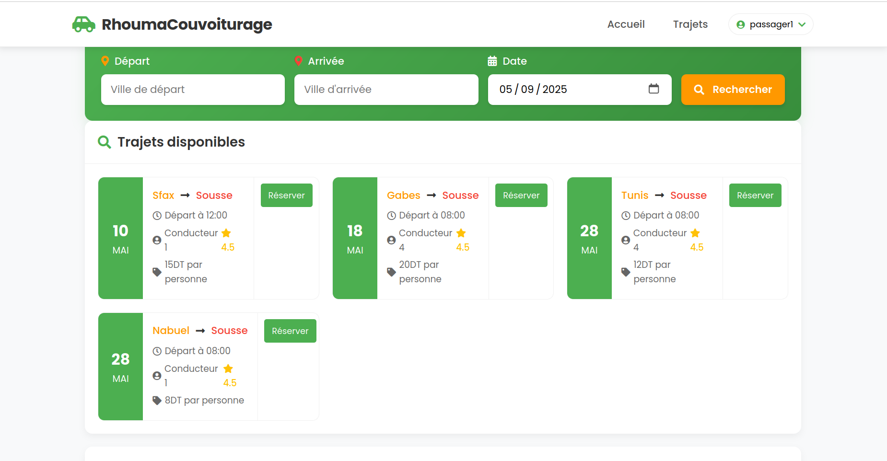

# Carpooling Microservices Application

A modern carpooling platform built using microservices architecture, enabling users to create, search, and book rides.


## Table of Contents

- [Architecture Overview](#architecture-overview)
- [Components](#components)
  - [Client Application](#client-application)
  - [API Gateway](#api-gateway)
  - [Authentication Service](#authentication-service)
  - [Trip Service](#trip-service)
  - [AI Service](#ai-service)
  - [Log Service](#log-service)
- [Data Schemas](#data-schemas)
- [API Documentation](#api-documentation)
  - [REST Endpoints](#rest-endpoints)
  - [GraphQL API](#graphql-api)
- [Authentication Flow](#authentication-flow)
- [Trip Service Flow](#trip-service-flow)
- [AI Service Flow](#ai-service-flow)
- [Log Service Flow](#log-service-flow)
- [API Gateway Flow](#api-gateway-flow)
- [User Journey](#user-journey)
- [Installation & Setup](#installation--setup)

## Architecture Overview

The application follows a microservices architecture pattern, with services communicating via gRPC and events being recorded through Kafka.


### gRPC Communication Flow

The microservices communicate with each other using gRPC (Google Remote Procedure Call), a high-performance RPC framework. Here's how the communication works:

#### API Gateway to Services
- **API Gateway → Auth Service**: The API Gateway communicates with the Auth Service through gRPC calls defined in `auth.proto`. It uses a gRPC client that connects to the Auth Service on port 50051, handling user registration, login, token verification, and logout operations.
- **API Gateway → Trip Service**: Communicates via gRPC using `trajet.proto`, connecting to the Trip Service on port 50052. Handles all trip-related operations like creating, reading, updating, and deleting trips as well as bookings.
- **API Gateway → AI Service**: Uses gRPC with `ia.proto` to communicate with the AI Service on port 50053, primarily for price prediction operations.

#### Service to Service Communication
- **Trip Service → AI Service**: The Trip Service directly communicates with the AI Service via gRPC to get price predictions for trips based on factors like available seats, departure, and destination.

#### Implementation Details
Each service implements:
1. **gRPC Server**: 
   - Listens on a specific port (Auth: 50051, Trip: 50052, AI: 50053)
   - Implements methods defined in the respective .proto files
   - Runs in parallel with the HTTP/REST server of each service

2. **gRPC Clients**:
   - API Gateway implements clients for all three services
   - Trip Service implements a client for the AI Service
   - Each client is configured with error handling and promise-based interfaces

This approach provides:
- Strong typing through Protocol Buffers
- Efficient binary serialization
- Stream support for real-time updates
- Language-agnostic communication (Node.js services can communicate with Python AI service)

### GraphQL/REST Communication Flow

The client application communicates with the API Gateway using both REST and GraphQL APIs, offering flexibility and optimized data fetching:

#### REST API Communication
- **Client → API Gateway**: The Angular client makes HTTP requests to the Express-based API Gateway endpoints following RESTful principles.
- **Implementation**:
  - Client uses Angular's HttpClient service to make HTTP calls
  - API Gateway exposes RESTful endpoints with Express routers
  - Authorization handled via JWT tokens in HTTP headers
  - Follows standard HTTP methods (GET, POST, PUT, DELETE) and status codes

#### GraphQL API Communication
- **Client → API Gateway**: The Angular client sends GraphQL queries and mutations to a single `/graphql` endpoint.
- **Implementation**:
  - Client uses Apollo Client to handle GraphQL operations
  - API Gateway implements Apollo Server to process GraphQL requests
  - GraphQL schema defines available queries and mutations
  - Resolvers in API Gateway translate GraphQL operations to gRPC calls to microservices
  - Batched queries reduce network overhead by combining multiple data requirements

#### Benefits of Dual API Approach
- **REST**: Simple, widely understood, excellent for CRUD operations
- **GraphQL**: Solves over-fetching/under-fetching, allows front-end to specify exact data needs
- **Choice**: Developers can choose the best approach depending on the use case
- **Flexibility**: Complex dashboards use GraphQL, simple forms use REST

### Kafka Event Flow

The application uses Kafka for event-driven communication, primarily for logging and monitoring. Unlike a typical distributed event system, in this architecture only the API Gateway produces events to Kafka:

#### Event Production
- **API Gateway → Kafka**: The API Gateway produces events to Kafka topics when significant actions occur in any service
- **Event Types**:
  - Trip events (creation, update, deletion, booking)
  - System events (errors, warnings, service status)

#### Event Consumption
- **Kafka → Log Service**: The Log Service consumes all events from relevant Kafka topics
- **Processing**:
  - Events are formatted with standardized structure
  - Logs saved to files with different levels (info, warn, error)
  - Important events trigger alerts or notifications

#### Implementation Details
- **Producer Configuration**: API Gateway uses Kafka producers with specified retry and batch settings
- **Consumer Groups**: Log Service uses consumer groups to ensure each message is processed once
- **Topic Organization**: Different topics for different event categories with appropriate partitioning
- **Message Format**: JSON structure with metadata, timestamp, service ID, and payload

#### Benefits
- **Centralized Logging**: All events flow through the API Gateway, providing a single point of logging
- **Scalability**: Kafka's distributed nature allows scaling of both producers and consumers
- **Reliability**: Message persistence ensures no events are lost even if Log Service is temporarily down
- **Real-time Analysis**: Enables real-time monitoring and alerting based on event streams

## Components

### Client Application

The frontend is built with Angular, providing interfaces for:
- User authentication (login, registration)
- Trip search with filtering options
- Trip creation and management for drivers
- Booking trips as a passenger
- Managing reservations

Technologies:
- Angular 17 (standalone components)
- Apollo Client for GraphQL operations
- Reactive forms for user input
- JWT token-based authentication

### API Gateway

Central entry point for client communication, responsible for:
- Routing requests to appropriate microservices
- Authentication and authorization
- Exposing both REST and GraphQL APIs
- Kafka event production for logging

Technologies:
- Express.js
- Apollo Server for GraphQL
- gRPC clients for microservice communication
- Kafka producer for event logging

### Authentication Service

Handles all user authentication operations:
- User registration
- Login with JWT token issuance
- Token verification
- Secure logout (token invalidation)

Technologies:
- Express.js
- gRPC server
- SQLite database for user storage
- Redis for token management and verification
- JWT for authentication tokens
- Bcrypt for password hashing

### Trip Service

Core service for trip management functionality:
- Creating and managing trips (CRUD operations)
- Trip search with multiple filters
- Booking system with reservation management
- Integration with AI service for price prediction

Technologies:
- Express.js
- gRPC server
- MongoDB for data storage
- Mongoose for data modeling

### AI Service

Provides intelligent price estimation for trips:
- ML-based price prediction model
- Takes into account factors like distance, available seats, etc.

Technologies:
- Python (FastAPI)
- gRPC server
- Scikit-learn for machine learning model
- Joblib for model serialization

### Log Service

Centralized logging service for monitoring and analysis:
- Consumes Kafka events from various services
- Records system events and user actions
- Structured logging for better analysis

Technologies:
- Node.js
- Kafka consumer
- Winston for structured logging

## Data Schemas

### User Schema (Authentication Service)

```sql
CREATE TABLE users (
  id INTEGER PRIMARY KEY AUTOINCREMENT,
  username TEXT UNIQUE NOT NULL,
  email TEXT UNIQUE NOT NULL,
  password TEXT NOT NULL,
  role TEXT NOT NULL CHECK (role IN ('conducteur', 'passager')),
  created_at TIMESTAMP DEFAULT CURRENT_TIMESTAMP,
  updated_at TIMESTAMP DEFAULT CURRENT_TIMESTAMP
)
```

### Trip Schema (Trip Service)

```javascript
const TrajetSchema = new mongoose.Schema({
  depart: { type: String, required: true },
  destination: { type: String, required: true },
  conducteurId: { type: Number, required: true },
  conducteurNom: { type: String },
  dateDepart: { type: Date, required: true },
  placesDisponibles: { type: Number, required: true, min: 1 },
  placesReservees: { type: Number, default: 0 },
  prix: { type: Number, required: true },
  description: { type: String },
  dateCreation: { type: Date, default: Date.now },
  reservations: [ReservationSchema]
});
```

### Reservation Schema (Trip Service)

```javascript
const ReservationSchema = new mongoose.Schema({
  _id: { type: String, required: true },
  passagerId: { type: Number, required: true },
  passagerNom: { type: String, required: true },
  places: { type: Number, required: true, min: 1 },
  dateReservation: { type: Date, default: Date.now }
});
```

## API Documentation

### REST Endpoints

#### Authentication

| Endpoint | Method | Description | Parameters | Response |
|----------|--------|-------------|------------|----------|
| `/api/auth/register` | POST | Register a new user | `username`, `email`, `password`, `role` | `{ success, message, token, userId, username, role }` |
| `/api/auth/login` | POST | Authenticate a user | `email`, `password` | `{ success, message, token, userId, username, role }` |
| `/api/auth/verify` | GET | Verify JWT token | Bearer token in header | `{ success, message, user }` |
| `/api/auth/logout` | POST | Logout and revoke token | Bearer token in header | `{ success, message }` |

#### Trips

| Endpoint | Method | Description | Auth Required | Response |
|----------|--------|-------------|---------------|----------|
| `/api/trajets` | GET | Get all trips with optional filters | No | `{ success, message, trajets: [Trajet] }` |
| `/api/trajets/:id` | GET | Get a trip by ID | No | `{ success, message, trajet: Trajet }` |
| `/api/mes-trajets` | GET | Get trips created by authenticated user | Yes | `{ success, message, trajets: [Trajet] }` |
| `/api/mes-reservations` | GET | Get trips booked by authenticated user | Yes | `{ success, message, trajets: [Trajet] }` |
| `/api/trajets` | POST | Create a new trip | Yes (driver role) | `{ success, message, trajet: Trajet }` |
| `/api/trajets/:id` | PUT | Update a trip | Yes (owner only) | `{ success, message, trajet: Trajet }` |
| `/api/trajets/:id` | DELETE | Delete a trip | Yes (owner only) | `{ success, message }` |
| `/api/trajets/:id/reservations` | POST | Book a trip | Yes | `{ success, message, reservation, trajet }` |
| `/api/trajets/:trajetId/reservations/:reservationId` | DELETE | Cancel a booking | Yes (passenger only) | `{ success, message }` |

#### AI Service

| Endpoint | Method | Description | Parameters | Response |
|----------|--------|-------------|------------|----------|
| `/api/ia/predict-price` | POST | Predict trip price | `placesDisponibles`, `depart`, `destination` | `{ success, message, prixEstime }` |

### GraphQL API

#### Queries

```graphql
# Authentication
query VerifyToken($token: String!) {
  verifyToken(token: $token) {
    success
    message
    user {
      id
      username
      email
      role
    }
  }
}

# Trips
query GetAllTrajets($filters: TrajetFilters) {
  trajets(filters: $filters) {
    success
    message
    trajets {
      id
      depart
      destination
      conducteurId
      conducteurNom
      dateDepart
      placesDisponibles
      placesReservees
      prix
      description
      dateCreation
      reservations {
        id
        passagerId
        passagerNom
        places
        dateReservation
      }
    }
  }
}

query GetTrajetById($id: ID!) {
  trajet(id: $id) {
    success
    message
    trajet {
      # Same fields as above
    }
  }
}

query GetMesTrajets {
  mesTrajets {
    success
    message
    trajets {
      # Same fields as above
    }
  }
}

query GetMesReservations {
  mesReservations {
    success
    message
    trajets {
      # Same fields as above
    }
  }
}

# AI
query PredictPrice($input: PricePredictionInput!) {
  predictPrice(input: $input) {
    success
    message
    prixEstime
  }
}
```

#### Mutations

```graphql
# Authentication
mutation Register($input: RegisterInput!) {
  register(input: $input) {
    success
    message
    token
    userId
    username
    role
  }
}

mutation Login($input: LoginInput!) {
  login(input: $input) {
    success
    message
    token
    userId
    username
    role
  }
}

mutation Logout($token: String!) {
  logout(token: $token) {
    success
    message
  }
}

# Trips
mutation CreateTrajet($input: TrajetInput!) {
  createTrajet(input: $input) {
    success
    message
    trajet {
      id
      depart
      destination
      dateDepart
      placesDisponibles
      prix
      description
    }
  }
}

mutation UpdateTrajet($id: ID!, $input: UpdateTrajetInput!) {
  updateTrajet(id: $id, input: $input) {
    success
    message
    trajet {
      # Trip fields
    }
  }
}

mutation DeleteTrajet($id: ID!) {
  deleteTrajet(id: $id) {
    success
    message
  }
}

mutation BookTrajet($input: BookingInput!) {
  bookTrajet(input: $input) {
    success
    message
    reservation {
      id
      passagerId
      passagerNom
      places
      dateReservation
    }
    trajet {
      id
      placesDisponibles
      placesReservees
    }
  }
}

mutation CancelBooking($input: CancelBookingInput!) {
  cancelBooking(input: $input) {
    success
    message
  }
}
```

## Authentication Flow

The application implements JWT token authentication with Redis-based token verification:

1. **Registration/Login**: User credentials are validated and a JWT token is issued
2. **Token Storage**:
   - Client stores token in localStorage
   - Server stores token in Redis with expiration time
3. **Request Authentication**:
   - Client includes token in Authorization header
   - API Gateway validates token through Auth Service
   - Auth Service checks token validity in Redis
4. **Logout**:
   - Token is removed from Redis
   - Client removes token from localStorage

This approach provides secure authentication with the ability to revoke tokens server-side.

Example of token verification flow:

```javascript
// API Gateway verification
const authenticate = async (req, res, next) => {
  const token = req.headers.authorization?.split(' ')[1];
  
  if (!token) {
    return res.status(401).json({ 
      success: false, 
      message: 'Authentication required' 
    });
  }

  try {
    const result = await verifyToken({ token });
    
    if (!result.success) {
      return res.status(401).json({ 
        success: false, 
        message: 'Invalid token' 
      });
    }
    
    // Store user information in the request
    req.user = result.user;
    next();
  } catch (error) {
    return res.status(500).json({ 
      success: false, 
      message: 'Authentication error' 
    });
  }
};
```

## Trip Service Flow

The Trip Service manages the core functionality of creating, updating, searching, and booking trips:

1. **Trip Creation**:
   - Driver submits trip details via client
   - API Gateway forwards request to Trip Service
   - Trip Service validates input and creates trip in MongoDB
   - Price recommendation requested from AI Service via gRPC
   - Trip creation event sent to Kafka for logging

2. **Trip Search & Filtering**:
   - User submits search parameters (location, date, seats)
   - API Gateway forwards search to Trip Service
   - Trip Service queries MongoDB with filters
   - Results returned with pagination for large result sets

3. **Trip Booking Process**:
   - Passenger selects trip and number of seats
   - API Gateway forwards booking request to Trip Service
   - Trip Service validates availability and creates reservation
   - Updates available seats count
   - Booking event sent to Kafka for logging
   - Both passenger and driver notified of booking

4. **Booking Cancellation**:
   - Passenger requests cancellation for a booking
   - Trip Service validates cancellation eligibility
   - Removes reservation and restores available seats
   - Cancellation event sent to Kafka for logging

5. **Trip Removal Process**:
   - Driver requests to delete their trip
   - Trip Service verifies the driver is the trip owner
   - Checks if trip has any active reservations
   - If reservations exist, notifies affected passengers about cancellation
   - Deletes the trip from the database
   - Trip deletion event sent to Kafka for logging and auditing

Example of trip booking implementation:

```javascript
const bookTrajet = async (trajetId, bookingData) => {
  try {
    // Find the trip by ID
    const trajet = await Trajet.findById(trajetId);
    if (!trajet) {
      return { 
        success: false, 
        message: 'Trajet non trouvé' 
      };
    }
    
    // Validate seat availability
    if (trajet.placesDisponibles < bookingData.places) {
      return { 
        success: false, 
        message: 'Pas assez de places disponibles' 
      };
    }
    
    // Create reservation with unique ID
    const reservationId = uuidv4();
    const newReservation = {
      _id: reservationId,
      passagerId: bookingData.passagerId,
      passagerNom: bookingData.passagerNom,
      places: bookingData.places,
      dateReservation: new Date()
    };
    
    // Update trip with new reservation and seat counts
    trajet.reservations.push(newReservation);
    trajet.placesReservees += bookingData.places;
    trajet.placesDisponibles -= bookingData.places;
    await trajet.save();
    
    // Emit booking event to Kafka
    producer.send({
      topic: 'booking-events',
      messages: [{
        value: JSON.stringify({
          eventType: 'booking_created',
          trajetId,
          reservation: newReservation
        })
      }]
    });
    
    return {
      success: true,
      message: 'Réservation créée avec succès',
      reservation: newReservation,
      trajet: {
        id: trajet._id,
        placesDisponibles: trajet.placesDisponibles,
        placesReservees: trajet.placesReservees
      }
    };
  } catch (error) {
    console.error('Erreur lors de la réservation:', error);
    return { success: false, message: 'Erreur lors de la réservation' };
  }
};
```

## AI Service Flow

The AI Service provides intelligent price predictions for trips using machine learning:

1. **Model Training**:
   - Historical trip data collected and preprocessed
   - Features extracted (distance, seats, time of day, etc.)
   - Linear regression model trained on dataset
   - Model evaluated and tuned for accuracy
   - Final model serialized with joblib and stored

2. **Price Prediction Process**:
   - Trip Service or API Gateway sends prediction request via gRPC
   - AI Service deserializes the prediction model
   - Input features processed and normalized
   - Model makes price prediction
   - Result returned with confidence level
   - Prediction requests logged for model improvement

3. **Model Updating**:
   - New trip data periodically collected
   - Model retrained with expanded dataset
   - Model performance evaluated against previous version
   - Updated model deployed if performance improves

Example of the price prediction implementation in Python:

```python
class PredictionServiceServicer(ia_pb2_grpc.PredictionServiceServicer):
    def PredictPrice(self, request, context):
        """
        Implementation of the PredictPrice method defined in the proto file
        Called by Trip Service via gRPC
        """
        if model is None:
            return ia_pb2.PricePredictionResponse(
                success=False,
                message="Prediction model could not be loaded",
                prixEstime=0.0
            )
        
        try:
            # Make prediction with the model
            places_disponibles = np.array([[request.placesDisponibles]])
            predicted_price = model.predict(places_disponibles)[0]
            predicted_price = round(predicted_price, 3)
            
            # Build location-aware response message
            location_info = ""
            if request.depart and request.destination:
                location_info = f" from {request.depart} to {request.destination}"
            
            return ia_pb2.PricePredictionResponse(
                success=True,
                message=f"Estimated price for {request.placesDisponibles} available seats{location_info}",
                prixEstime=float(predicted_price)
            )
        except Exception as e:
            print(f"Price prediction error: {e}")
            return ia_pb2.PricePredictionResponse(
                success=False,
                message=f"Error during price prediction: {str(e)}",
                prixEstime=0.0
            )
```

## Log Service Flow

The Log Service centralizes logging and monitoring across all microservices:

1. **Event Collection**:
   - Services produce events to Kafka topics
   - Log Service consumes events from multiple topics
   - Events categorized by type and severity
   - Structured data extracted from events

2. **Log Processing**:
   - Events enriched with metadata (timestamp, service name, environment)
   - Logs formatted according to standardized schema
   - Different log levels handled appropriately (info, warn, error)
   - Log files rotated and managed for efficient storage

3. **Alerting & Monitoring**:
   - Critical errors flagged for immediate attention
   - Threshold-based alerts for repeated errors
   - Service health metrics derived from log patterns
   - Periodic summary reports generated

Example of Kafka consumer implementation in Log Service:

```javascript
const setupKafkaConsumer = async () => {
  try {
    await consumer.connect();
    
    // Subscribe to multiple topics
    await consumer.subscribe({ 
      topics: ['auth-events', 'trip-events', 'system-events'], 
      fromBeginning: true 
    });
    
    await consumer.run({
      eachMessage: async ({ topic, partition, message }) => {
        try {
          const eventData = JSON.parse(message.value.toString());
          const { eventType, serviceId, timestamp, payload, level = 'info' } = eventData;
          
          // Log with appropriate level
          logger.log({
            level,
            message: `${eventType} from ${serviceId}`,
            eventType,
            serviceId,
            timestamp: timestamp || Date.now(),
            topic,
            partition,
            payload
          });
          
          // Trigger alerts for error-level events
          if (level === 'error') {
            await alertService.triggerAlert(eventData);
          }
          
        } catch (error) {
          logger.error('Error processing Kafka message', { error: error.message });
        }
      }
    });
    
    console.log('Kafka consumer started successfully');
  } catch (error) {
    console.error('Failed to start Kafka consumer:', error);
    process.exit(1);
  }
};
```

## API Gateway Flow

The API Gateway serves as the central entry point for all client requests, coordinating communication between the client and various microservices:

1. **Request Routing**:
   - Client sends HTTP request (REST or GraphQL) to the API Gateway
   - Gateway identifies the target service based on URL path or GraphQL operation
   - Request is transformed into appropriate gRPC call format
   - gRPC call is made to the relevant microservice
   - Response is transformed back to HTTP/JSON and returned to client

2. **Authentication & Authorization**:
   - Gateway extracts JWT token from request headers
   - Token is verified via Auth Service gRPC call
   - User identity and permissions are attached to the request context
   - Requests to protected endpoints are blocked if authentication fails
   - Role-based access control enforced based on user role

3. **GraphQL Processing**:
   - Client sends GraphQL query/mutation to the `/graphql` endpoint
   - Apollo Server parses and validates the GraphQL operation
   - Resolvers map GraphQL operations to gRPC service calls
   - Multiple microservice calls may be combined for a single GraphQL request
   - Results are assembled according to GraphQL schema and returned

4. **API Versioning & Documentation**:
   - REST endpoints follow versioning convention (e.g., `/v1/api/...`)
   - Swagger/OpenAPI documentation auto-generated for REST API
   - GraphQL schema provides built-in documentation with introspection
   - Deprecation notices included for outdated endpoints

Example of API Gateway resolver implementation:

```javascript
// GraphQL resolver that communicates with the Trip Service via gRPC
const trajetResolvers = {
  Query: {
    trajet: async (_, { id }, context) => {
      try {
        // Validate authentication if needed
        if (context.requireAuth) {
          // Check if the user is authenticated
          if (!context.user) {
            return { 
              success: false, 
              message: 'Authentication required' 
            };
          }
        }
        
        // Make gRPC call to Trip Service
        const response = await trajetClient.getTrajetById({ id });
        return response;
      } catch (error) {
        console.error('GraphQL trajet query error:', error);
        return { 
          success: false, 
          message: 'Error retrieving trip details' 
        };
      }
    },
    
    trajets: async (_, { filters }, context) => {
      try {
        // Transform GraphQL filters to gRPC request format
        const gRpcFilters = {
          depart: filters?.depart || '',
          destination: filters?.destination || '',
          dateDepart: filters?.dateDepart || '',
          placesMinimum: filters?.placesMinimum || 1,
          prixMax: filters?.prixMax || 0
        };
        
        // Make gRPC call to Trip Service
        const response = await trajetClient.getAllTrajets(gRpcFilters);
        
        // Transform response if needed
        return {
          success: response.success,
          message: response.message,
          trajets: response.trajets || []
        };
      } catch (error) {
        console.error('GraphQL trajets query error:', error);
        return { 
          success: false, 
          message: 'Error retrieving trips', 
          trajets: [] 
        };
      }
    }
  },
  
  Mutation: {
    createTrajet: async (_, { input }, context) => {
      // Check authentication
      if (!context.user) {
        return { 
          success: false, 
          message: 'Authentication required' 
        };
      }
      
      // Validate user role
      if (context.user.role !== 'conducteur') {
        return { 
          success: false, 
          message: 'Only drivers can create trips' 
        };
      }
      
      try {
        // Add user info to the trip data
        const trajetData = {
          ...input,
          conducteurId: context.user.id,
          conducteurNom: context.user.username
        };
        
        // Make gRPC call to Trip Service
        const response = await trajetClient.createTrajet(trajetData);
        
        // Log successful trip creation
        if (response.success) {
          kafkaProducer.send({
            topic: 'trip-events',
            messages: [{
              value: JSON.stringify({
                eventType: 'trip_created',
                serviceId: 'api-gateway',
                userId: context.user.id,
                trajetId: response.trajet.id,
                timestamp: Date.now()
              })
            }]
          });
        }
        
        return response;
      } catch (error) {
        console.error('GraphQL createTrajet mutation error:', error);
        return { 
          success: false, 
          message: 'Error creating trip' 
        };
      }
    }
  }
};
```

## User Journey

### Authentication Flow

Users can register as either a driver or passenger:


### Driver Experience

Drivers can create and manage trips:


### Passenger Experience

Passengers can search for trips and book them:





### Logging and Event Tracking

The system records all important events using Kafka:


## Installation & Setup

### Prerequisites

- Node.js 16+
- Python 3.8+
- MongoDB
- Redis
- Kafka

### Setup Instructions

1. Clone the repository
2. Install dependencies for each service:
   ```bash
   # Client
   cd client
   npm install

   # API Gateway
   cd ../services/api-gateway
   npm install

   # Auth Service
   cd ../service-auth
   npm install

   # Trip Service
   cd ../service-trajet
   npm install

   # AI Service
   cd ../service-ia
   pip install -r requirements.txt

   # Log Service
   cd ../service-log
   npm install
   ```

3. Configure environment variables for each service
4. Start the services:
   ```bash
   # Start services in separate terminals
   # Auth Service
   cd services/service-auth
   npm start

   # Trip Service
   cd services/service-trajet
   npm start

   # AI Service
   cd services/service-ia
   python main.py

   # Log Service
   cd services/service-log
   npm start

   # API Gateway
   cd services/api-gateway
   npm start

   # Client
   cd client
   npm start
   ```

5. Access the application at http://localhost:4200